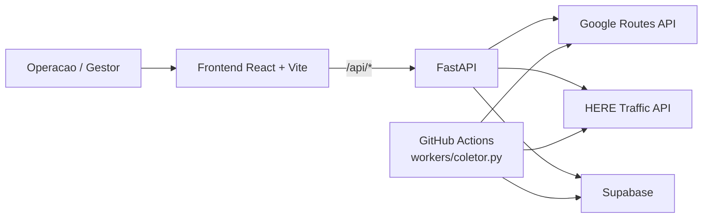

# Monitoramento Dinamico

Plataforma full-stack para monitoramento de trafego rodoviario em rotas corporativas de longa distancia. O projeto combina painel operacional, consulta on-demand, exportacao gerencial e coleta automatizada de snapshots usando Google Routes API e HERE Traffic.

## O que o projeto entrega

- painel corporativo com 20 rotas predefinidas e classificacao operacional padronizada;
- consulta detalhada por rota com mapa, incidentes, tempos, velocidades e links externos;
- exportacao em Excel e CSV para analise operacional;
- historico de ciclos salvos no Supabase;
- worker agendado para coleta periodica via GitHub Actions.

Hoje o dataset embarcado cobre **20 rotas** e aproximadamente **22.351,7 km** de rodovias corporativas.

## Por que este repo importa

Ferramentas de navegacao B2C resolvem trajetos individuais; operacoes logisticas precisam de consolidacao, contexto e repetibilidade. Este sistema foi estruturado para responder perguntas operacionais como:

- quais rotas estao em estado `Intenso` ou `Parado` agora;
- qual foi o atraso medido e qual incidente explica esse atraso;
- o problema veio do ciclo periodico salvo ou de consulta em tempo real;
- como exportar e compartilhar uma visao executiva sem abrir o painel.

## Arquitetura em uma tela



## Stack

| Camada | Tecnologias principais |
| --- | --- |
| Frontend | React 18, Vite 6, TypeScript, Tailwind 4, Radix UI, Leaflet, Recharts |
| Backend | Python 3.11, FastAPI, Uvicorn, httpx, requests, PyYAML, openpyxl |
| Dados | Supabase |
| Automacao | GitHub Actions |
| Entrega web | Vercel no frontend com rewrite para backend publico |

## Estrutura do repositorio

| Caminho | Papel |
| --- | --- |
| `frontend/` | SPA React, paginas `Login`, `Painel` e `Consulta` |
| `backend/` | API FastAPI, regras de negocio, worker, persistencia e testes |
| `docs/` | arquitetura, onboarding tecnico, operacao e relatorios |
| `presentation/` | material de apresentacao executiva |
| `.github/workflows/` | automacao do coletor |

## Comecando rapido

### 1. Backend

```bash
cd backend
python -m venv .venv
.venv\Scripts\activate
pip install -r requirements.txt
python main.py --web
```

Backend local: `http://127.0.0.1:8000`

Docs automaticas do FastAPI:

- `http://127.0.0.1:8000/docs`
- `http://127.0.0.1:8000/redoc`

### 2. Frontend

```bash
cd frontend
npm ci
npm run dev
```

Frontend local: `http://127.0.0.1:5173`

O dev server faz proxy de `"/api/*"` para o backend local, que e o mesmo contrato usado em producao.

## Variaveis de ambiente

O projeto usa `backend/config.yaml` apenas como base publica e aplica override por ambiente em runtime. O template de referencia esta em [`backend/.env.example`](backend/.env.example).

Variaveis esperadas:

- `GOOGLE_MAPS_API_KEY`
- `HERE_API_KEY`
- `SUPABASE_URL`
- `SUPABASE_SERVICE_ROLE_KEY`
- `SUPABASE_KEY` para compatibilidade
- `AUTH_LOCAL_ENABLED`
- `AUTH_LOCAL_USERNAME`
- `AUTH_LOCAL_PASSWORD`
- `AUTH_LOCAL_SESSION_SECRET`
- `AUTH_COOKIE_SECURE`

## Fluxos principais

### Painel corporativo

- o frontend chama `GET /api/painel`;
- o backend le o ultimo ciclo salvo no Supabase;
- o painel ordena rotas por severidade e abre a consulta detalhada em nova aba.

### Consulta detalhada

- a pagina tenta primeiro `GET /api/rotas/{rota_id}/snapshot`;
- em seguida busca `GET /api/rotas/{rota_id}/consultar` para dados completos;
- o resultado exibe polyline, incidentes, metricas e exportacoes locais.

### Coleta periodica

- o workflow [`monitor_dinamico.yml`](.github/workflows/monitor_dinamico.yml) roda **a cada hora**;
- executa `backend/workers/coletor.py`;
- grava snapshots no Supabase e publica o Excel do ciclo como artifact.

## Documentacao

- guia de docs: [`docs/README.md`](docs/README.md)
- onboarding tecnico: [`docs/getting-started.md`](docs/getting-started.md)
- operacao e API: [`docs/api-e-operacao.md`](docs/api-e-operacao.md)
- arquitetura: [`docs/arquitetura/README.md`](docs/arquitetura/README.md)
- apresentacao executiva: [`presentation/index.html`](presentation/index.html) e [`presentation/Dynamic_Logistics_Intelligence.pdf`](presentation/Dynamic_Logistics_Intelligence.pdf)

## Verificacao local

Backend:

```bash
cd backend
pytest
```

Frontend:

```bash
cd frontend
npm run build
```

## Notas de operacao

- o `vercel.json` atual faz rewrite de `"/api/:path*"` para o backend publico configurado no projeto;
- o backend mantem `GET /healthz` para health check;
- segredos nao devem ser versionados;
- `backend/config.yaml` deve continuar com placeholders publicos, nunca com credenciais reais.
