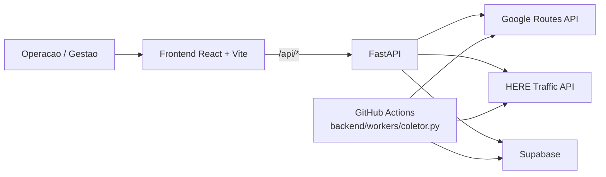

<div align="center">

# Monitoramento Dinamico

### Painel corporativo para leitura operacional de rotas rodoviarias em longa distancia

Consolida trafego, incidentes, atraso e historico de snapshots em uma camada unica de operacao, consulta detalhada e exportacao gerencial.

[](https://react.dev)
[](https://vitejs.dev)
[](https://fastapi.tiangolo.com)
[](https://supabase.com)
[](https://developers.google.com/maps/documentation/routes)
[](https://www.here.com)

[]()
[]()
[]()
[]()

</div>

---

## Sumario

- [Visao Geral](#visao-geral)
- [Modos de Uso](#modos-de-uso)
- [Interfaces do Produto](#interfaces-do-produto)
- [Arquitetura](#arquitetura)
- [Fluxo de Dados](#fluxo-de-dados)
- [Superficie HTTP](#superficie-http)
- [Stack](#stack)
- [Estrutura do Repositorio](#estrutura-do-repositorio)
- [Quick Start](#quick-start)
- [Variaveis de Ambiente](#variaveis-de-ambiente)
- [Fluxos Importantes](#fluxos-importantes)
- [Verificacao Local](#verificacao-local)
- [Documentacao](#documentacao)
- [Deploy e Operacao](#deploy-e-operacao)

---

## Visao Geral

**Monitoramento Dinamico** e uma plataforma full-stack para monitoramento rodoviario em rotas corporativas de longa distancia.

O produto foi desenhado para responder, no mesmo fluxo operacional, perguntas como:

- quais rotas estao em `Intenso` ou `Parado` agora;
- qual foi o atraso medido na ultima leitura;
- quais incidentes ajudam a explicar o estado da rota;
- como abrir uma consulta detalhada por trecho sem sair do painel;
- como exportar o ciclo atual para consumo executivo.

### O problema que o projeto resolve

Ferramentas B2C mostram o melhor caminho para um motorista. Operacoes logisticas precisam de outra camada:

- consolidacao de multiplas rotas predefinidas;
- classificacao operacional padronizada;
- contexto historico do ultimo ciclo salvo;
- consulta on-demand com mapa, incidentes e exportacao;
- repetibilidade para operacao, gestao e auditoria.

### O que esta pronto hoje

- painel corporativo com leitura consolidada de 20 rotas;
- consulta detalhada por rota com mapa, incidentes, tempos e velocidades;
- exportacao em Excel e CSV;
- snapshots persistidos no Supabase;
- worker periodico via GitHub Actions.

> Dataset atual: **20 rotas** e aproximadamente **22.351,7 km** de malha rodoviaria monitorada.

---

## Modos de Uso

O backend atual suporta dois modos de execucao:

### 1. Servidor web

Usado pelo frontend React e por consumidores HTTP.

```bash
cd backend
python main.py --web
```

### 2. Consulta via terminal

Bom para diagnostico rapido sem subir a interface.

```bash
cd backend
python main.py --consultar "Campinas, SP" "Sao Paulo, SP"
python main.py --consultar "Campinas, SP" "Sao Paulo, SP" --json
```

O README anterior tratava o projeto apenas como painel web; hoje isso esta incompleto, porque o modo CLI continua suportado em [main.py](backend/main.py).

---

## Interfaces do Produto

### Painel corporativo

Tela de comando para triagem rapida do ciclo:

- leitura agregada por status da rota;
- filtros por status, via, nome, trecho e ocorrencia;
- cards priorizados por severidade;
- acesso direto para abrir a consulta detalhada da rota.

### Consulta detalhada

Visao aprofundada por rota:

- polyline do trajeto e mapa interativo;
- incidentes associados ao trecho;
- duracao normal vs. duracao com trafego;
- velocidade media e atraso;
- exportacao local e links externos.

### Coleta automatizada

Pipeline de atualizacao recorrente:

- coleta tempos via Google Routes API;
- coleta incidentes e jam factor via HERE Traffic API;
- grava snapshots no Supabase;
- publica artefatos em Excel no workflow agendado.

---

## Arquitetura



### Camadas principais

- `frontend/`: painel operacional, login e consulta detalhada;
- `backend/`: API FastAPI, logica de negocio, persistencia e exportacao;
- `Supabase`: historico dos ciclos e snapshots;
- `GitHub Actions`: automacao da coleta recorrente.

---

## Fluxo de Dados

1. O painel chama `GET /api/painel`.
2. O backend busca o ultimo ciclo salvo no Supabase.
3. O frontend ordena e apresenta as rotas por severidade operacional.
4. Ao abrir uma rota, a consulta detalhada tenta primeiro o snapshot salvo e depois complementa com consulta aprofundada.
5. O worker agenda novas leituras e grava o proximo ciclo.

---

## Superficie HTTP

### Endpoints publicos

- `GET /healthz`
- `POST /auth/login`
- `POST /auth/logout`
- `GET /auth/session`
- `GET /consultar`
- `GET /exportar/excel`
- `GET /exportar/csv`

### Endpoints protegidos por sessao local

- `GET /painel`
- `GET /rotas`
- `GET /rotas/{rota_id}`
- `GET /rotas/{rota_id}/snapshot`
- `GET /rotas/{rota_id}/consultar`
- `GET /painel/exportar/excel`
- `GET /painel/exportar/csv`
- `GET /favoritos`
- `POST /favoritos`
- `DELETE /favoritos`
- `GET /cache/info`
- `DELETE /cache`

### Aliases legados ainda ativos

- `GET /visao-geral`
- `GET /consultar/exportar/excel`
- `GET /consultar/exportar/csv`

Isso importa porque o projeto hoje nao e apenas um frontend com um backend opaco; existe uma superficie HTTP clara em [app.py](backend/web/app.py) que o README precisa refletir.

---

## Stack

| Camada | Tecnologias principais |
| --- | --- |
| Frontend | React 18, Vite 6, TypeScript, Tailwind 4, Radix UI, Leaflet, Recharts |
| Backend | Python 3.11, FastAPI, Uvicorn, httpx, requests, PyYAML, openpyxl |
| Dados | Supabase |
| Integracoes | Google Routes API, HERE Traffic API |
| Automacao | GitHub Actions |
| Entrega web | Vercel com rewrite para backend publico |

---

## Estrutura do Repositorio

| Caminho | Papel |
| --- | --- |
| `frontend/` | SPA React com `Login`, `Painel` e `Consulta` |
| `backend/` | API, regras de negocio, persistencia, exportacao e testes |
| `docs/` | arquitetura, onboarding tecnico, operacao e relatorios |
| `presentation/` | material de apresentacao executiva |
| `.github/workflows/` | automacao do coletor periodico |

---

## Quick Start

### 1. Backend

```bash
cd backend
python -m venv .venv
.venv\Scripts\activate
pip install -r requirements.txt
python main.py --web
```

Backend local:

- `http://127.0.0.1:8000`
- `http://127.0.0.1:8000/docs`
- `http://127.0.0.1:8000/redoc`

### 2. Frontend

```bash
cd frontend
npm ci
npm run dev
```

Frontend local:

- `http://127.0.0.1:5173`

O dev server faz proxy de `"/api/*"` para o backend local, o mesmo contrato usado em producao.

### 3. Auth local em desenvolvimento

Por padrao, `AUTH_LOCAL_ENABLED=false`, entao o backend responde como autenticado para o fluxo local e o painel abre sem login forçado.

Se quiser testar o fluxo de login por cookie:

```bash
set AUTH_LOCAL_ENABLED=true
set AUTH_LOCAL_USERNAME=operacao
set AUTH_LOCAL_PASSWORD=sua_senha
set AUTH_LOCAL_SESSION_SECRET=um_segredo_real
set AUTH_COOKIE_SECURE=false
```

Com auth habilitada:

- `/painel` e `/rotas/*` exigem sessao;
- o frontend redireciona para `/login` quando recebe `401`;
- placeholders inseguros podem bloquear o auth com `503`.

---

## Variaveis de Ambiente

O projeto usa `backend/config.yaml` apenas como base publica e aplica override por ambiente em runtime. O template de referencia esta em [`backend/.env.example`](backend/.env.example).

Variaveis esperadas:

- `GOOGLE_MAPS_API_KEY`
- `HERE_API_KEY`
- `SUPABASE_URL`
- `SUPABASE_SERVICE_ROLE_KEY`
- `SUPABASE_KEY`
- `AUTH_LOCAL_ENABLED`
- `AUTH_LOCAL_USERNAME`
- `AUTH_LOCAL_PASSWORD`
- `AUTH_LOCAL_SESSION_SECRET`
- `AUTH_COOKIE_SECURE`

Valores padrao publicos continuam em [`backend/config.yaml`](backend/config.yaml), mas segredos reais devem entrar por ambiente.

Observacoes importantes:

- `AUTH_LOCAL_ENABLED=false` e o comportamento padrao;
- `SUPABASE_SERVICE_ROLE_KEY` e a chave principal esperada para persistencia;
- `SUPABASE_KEY` ainda existe como fallback legado;
- `cache.ttl_segundos` hoje e `300` no config publico.

---

## Fluxos Importantes

### Painel corporativo

- chama `GET /api/painel`;
- le o ultimo ciclo salvo no Supabase;
- organiza as rotas por severidade e libera a consulta detalhada em nova aba.

### Consulta detalhada

- tenta primeiro `GET /api/rotas/{rota_id}/snapshot`;
- depois complementa com `GET /api/rotas/{rota_id}/consultar`;
- exibe polyline, incidentes, metricas e exportacoes locais.

### Coleta periodica

- o workflow [`monitor_dinamico.yml`](.github/workflows/monitor_dinamico.yml) roda a cada **30 minutos**;
- executa `backend/workers/coletor.py`;
- grava snapshots no Supabase;
- publica o Excel do ciclo como artifact.

### Exportacao

- `GET /painel/exportar/excel` e `GET /painel/exportar/csv` exportam a visao agregada;
- `GET /exportar/excel` e `GET /exportar/csv` exportam uma consulta individual;
- os aliases em `/consultar/exportar/*` continuam disponiveis por retrocompatibilidade.

---

## Verificacao Local

### Backend

```bash
cd backend
pytest
```

### Frontend

```bash
cd frontend
npm run build
```

---

## Documentacao

- guia geral: [`docs/README.md`](docs/README.md)
- onboarding tecnico: [`docs/getting-started.md`](docs/getting-started.md)
- operacao e API: [`docs/api-e-operacao.md`](docs/api-e-operacao.md)
- arquitetura: [`docs/arquitetura/README.md`](docs/arquitetura/README.md)
- apresentacao executiva: [`presentation/index.html`](presentation/index.html)
- PDF executivo: [`presentation/Dynamic_Logistics_Intelligence.pdf`](presentation/Dynamic_Logistics_Intelligence.pdf)

---

## Deploy e Operacao

- `vercel.json` hoje reescreve `"/api/:path*"` para `https://monitoramento-dinamico-production.up.railway.app/:path*`;
- o backend mantem `GET /healthz` para health check;
- `backend/config.yaml` deve permanecer com placeholders publicos;
- segredos nunca devem ser versionados;
- o backend ainda serve uma interface HTML legada em `backend/web/static/index.html`;
- o material em `presentation/` pode ser usado em demos e apresentacoes executivas.
