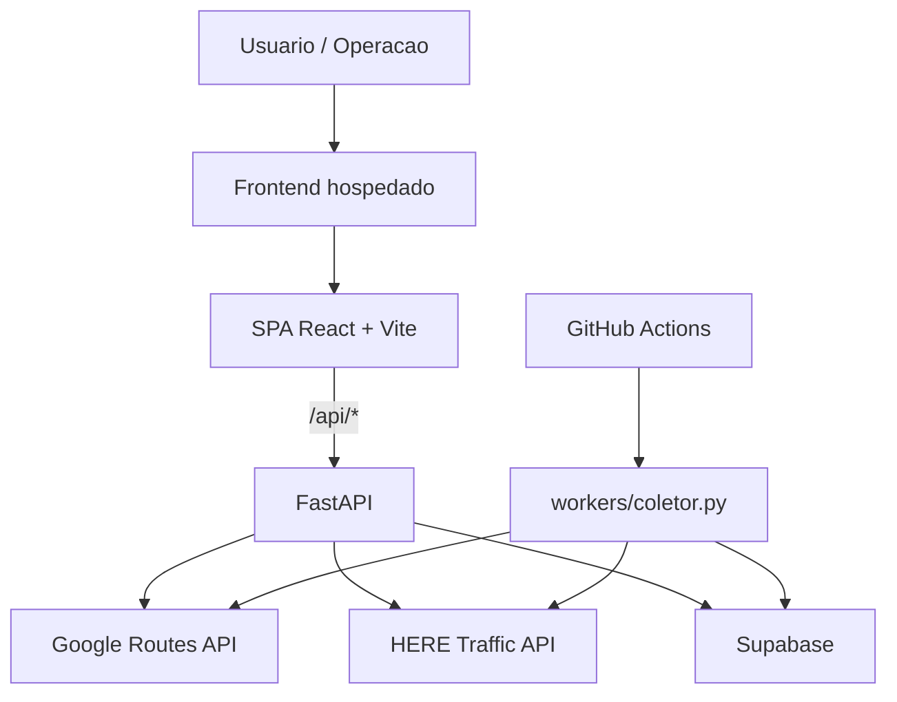
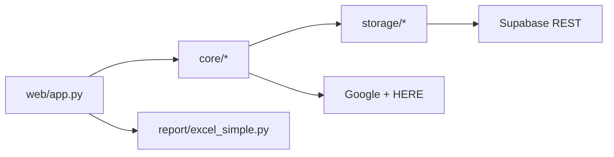

# Visao Geral da Arquitetura

## Topologia principal

## Responsabilidades por bloco

| Bloco | Responsabilidade |
| --- | --- |
| Frontend | login local, painel agregado, consulta detalhada e exportacao local |
| FastAPI | auth, consulta on-demand, agregacao do painel, exportacao de relatorios |
| Worker | coleta horaria, consolidacao e persistencia de snapshots |
| Supabase | armazenamento de ciclos e snapshots |
| APIs externas | tempo de rota, incidentes, velocidade e jam factor |

## Camadas internas do backend

## Componentes de negocio mais relevantes

| Arquivo | Papel |
| --- | --- |
| `backend/core/consultor.py` | merge de Google e HERE em consulta detalhada |
| `backend/core/painel_service.py` | conversao para o contrato agregado do painel |
| `backend/core/auth_local.py` | sessao por cookie e validacao local |
| `backend/storage/repository.py` | escrita de snapshots no Supabase |
| `backend/workers/coletor.py` | coleta automatica das 20 rotas |
