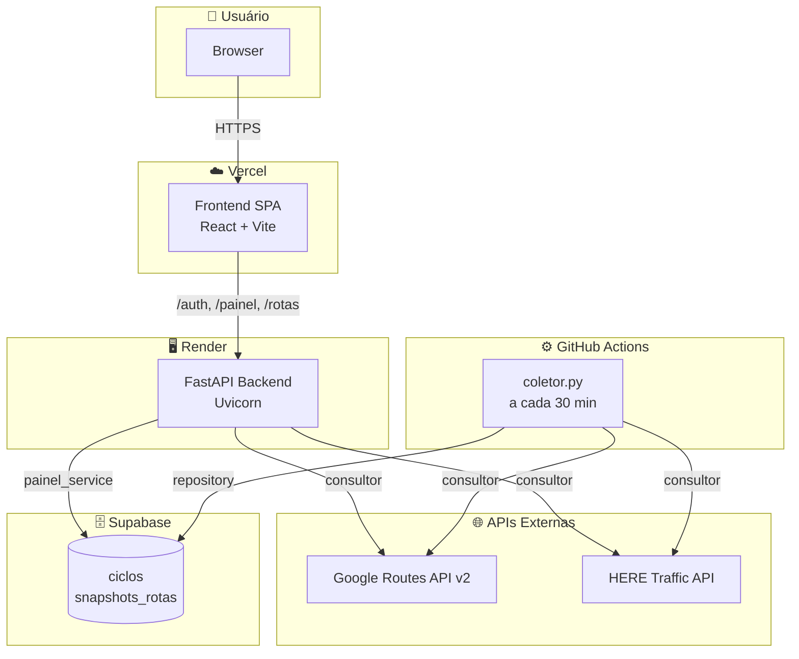
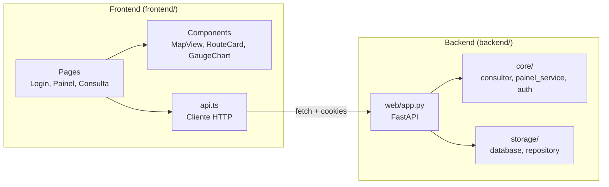
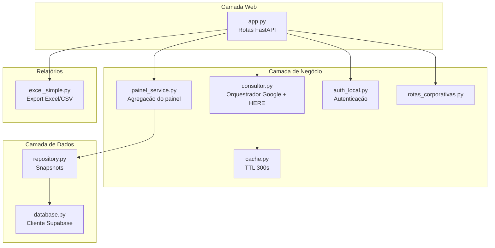

# Visão Geral da Arquitetura

## Diagrama de alto nível

```mermaid
flowchart TB
    subgraph Usuario["👤 Usuário"]
        Browser[Browser]
    end

    subgraph Vercel["☁️ Vercel"]
        SPA[Frontend SPA<br/>React + Vite]
    end

    subgraph Render["🖥️ Render"]
        API[FastAPI Backend<br/>Uvicorn]
    end

    subgraph GitHub["⚙️ GitHub Actions"]
        Coletor[coletor.py<br/>a cada 30 min]
    end

    subgraph APIs["🌐 APIs Externas"]
        Google[Google Routes API v2]
        HERE[HERE Traffic API]
    end

    subgraph Supabase["🗄️ Supabase"]
        DB[(ciclos<br/>snapshots_rotas)]
    end

    Browser -->|HTTPS| SPA
    SPA -->|/auth, /painel, /rotas| API
    API -->|consultor| Google
    API -->|consultor| HERE
    API -->|painel_service| DB
    Coletor -->|consultor| Google
    Coletor -->|consultor| HERE
    Coletor -->|repository| DB
```

## Componentes principais

```mermaid
flowchart LR
    subgraph Frontend["Frontend (frontend/)"]
        Pages[Pages<br/>Login, Painel, Consulta]
        Components[Components<br/>MapView, RouteCard, GaugeChart]
        API_Client[api.ts<br/>Cliente HTTP]
    end

    subgraph Backend["Backend (backend/)"]
        Web[web/app.py<br/>FastAPI]
        Core[core/<br/>consultor, painel_service, auth]
        Storage[storage/<br/>database, repository]
    end

    Pages --> Components
    Pages --> API_Client
    API_Client -->|fetch + cookies| Web
    Web --> Core
    Web --> Storage
```

## Camadas do backend

```mermaid
flowchart TB
    subgraph Web["Camada Web"]
        App[app.py<br/>Rotas FastAPI]
    end

    subgraph Core["Camada de Negócio"]
        Consultor[consultor.py<br/>Orquestrador Google + HERE]
        Painel[painel_service.py<br/>Agregação do painel]
        Auth[auth_local.py<br/>Autenticação]
        Cache[cache.py<br/>TTL 300s]
        Rotas[rotas_corporativas.py]
    end

    subgraph Storage["Camada de Dados"]
        DB_Client[database.py<br/>Cliente Supabase]
        Repo[repository.py<br/>Snapshots]
    end

    subgraph Report["Relatórios"]
        Excel[excel_simple.py<br/>Export Excel/CSV]
    end

    App --> Consultor
    App --> Painel
    App --> Auth
    App --> Rotas
    Consultor --> Cache
    Painel --> Repo
    Repo --> DB_Client
    App --> Excel
```
