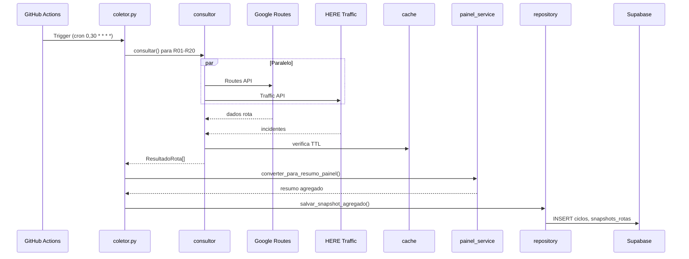
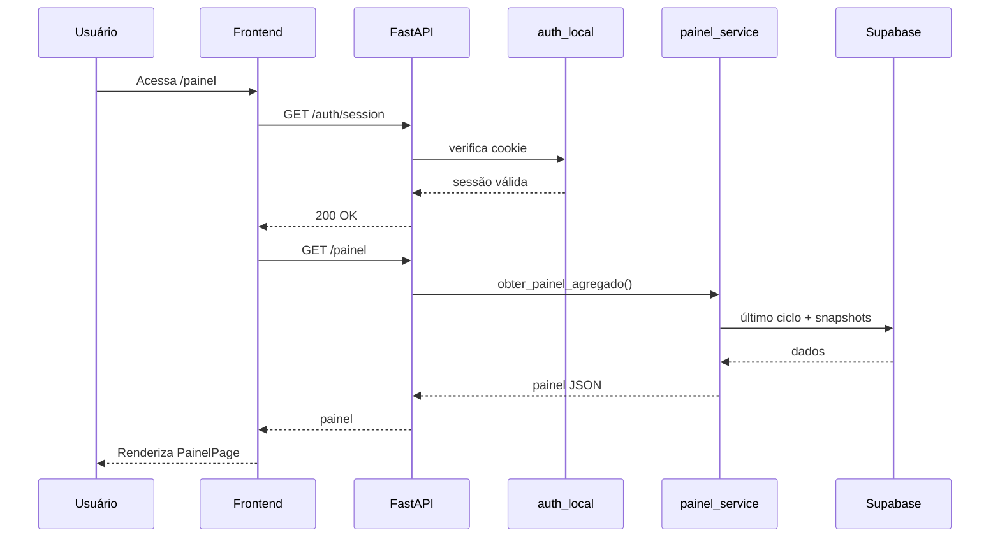
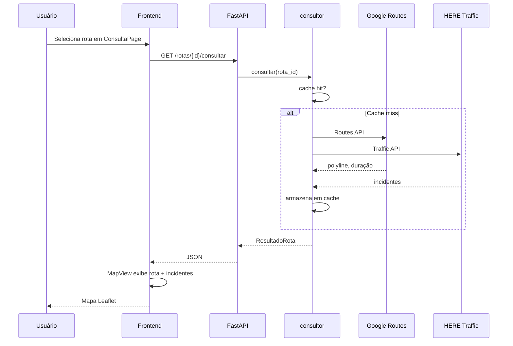
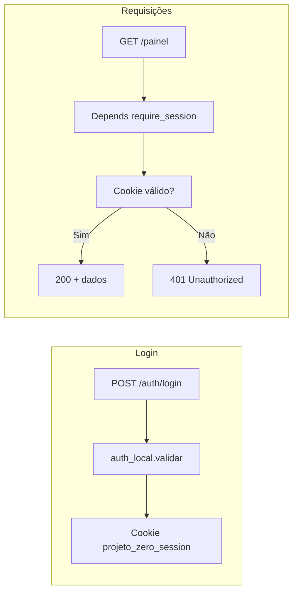

# Fluxo de Dados

## Fluxo do coletor (GitHub Actions)

O coletor roda a cada 30 minutos e alimenta o Supabase com dados agregados.

## Fluxo do painel (usuário autenticado)

## Fluxo da consulta on-demand (rota específica)

## Fluxo de autenticação

