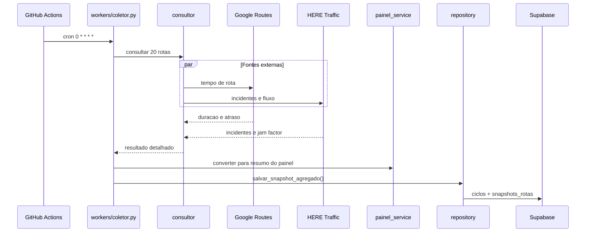
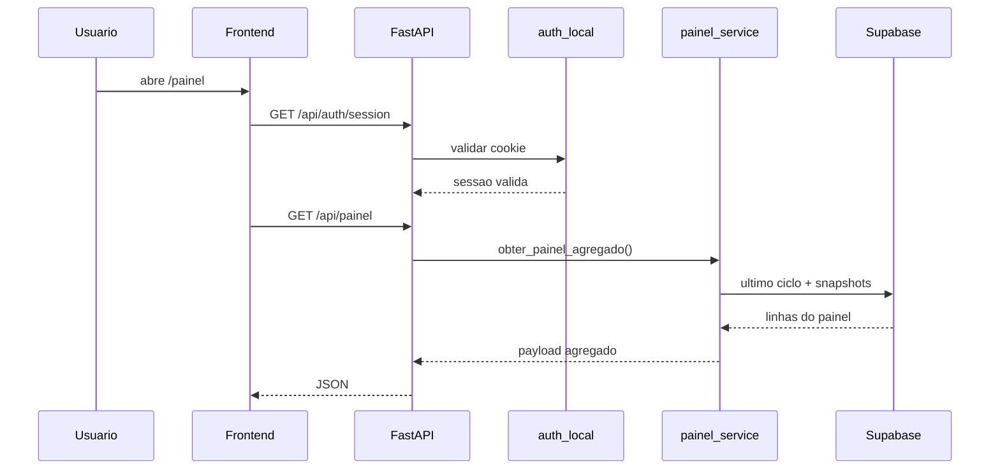
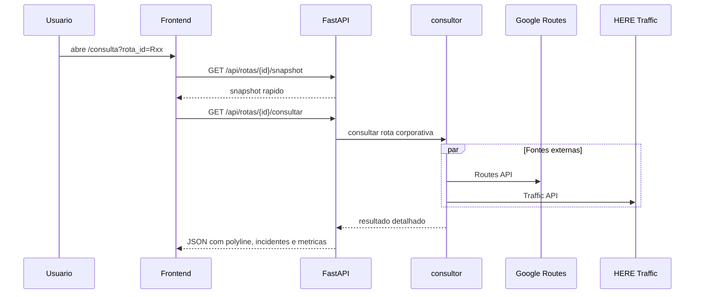
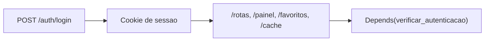

# Fluxo de Dados

## Coleta periodica

O workflow do GitHub Actions roda **a cada hora** e executa o worker diretamente. O backend web nao participa desse ciclo.

## Painel agregado

## Consulta detalhada

## Autenticacao local

