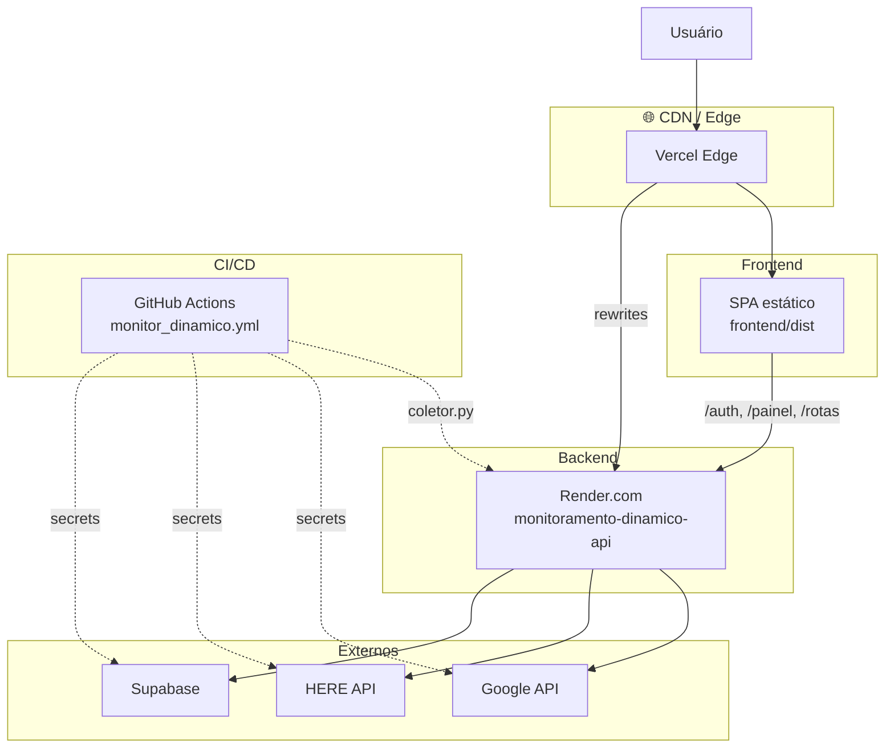
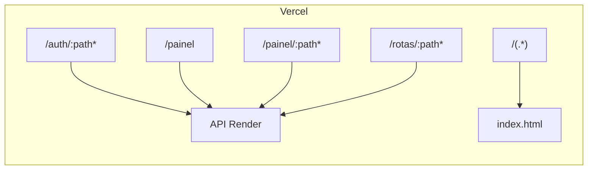
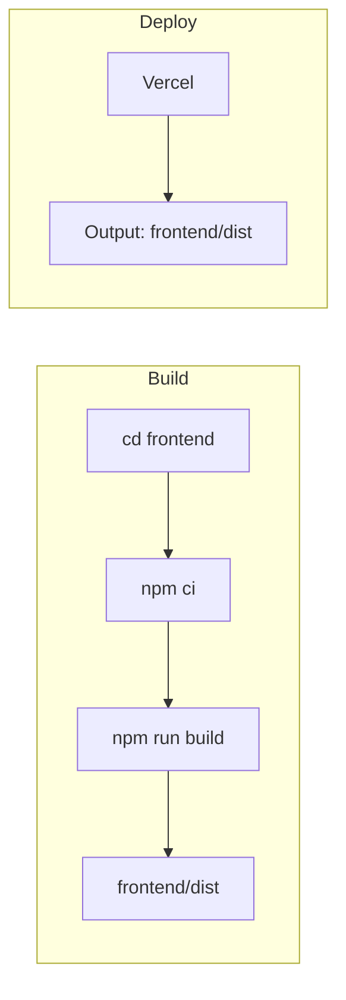
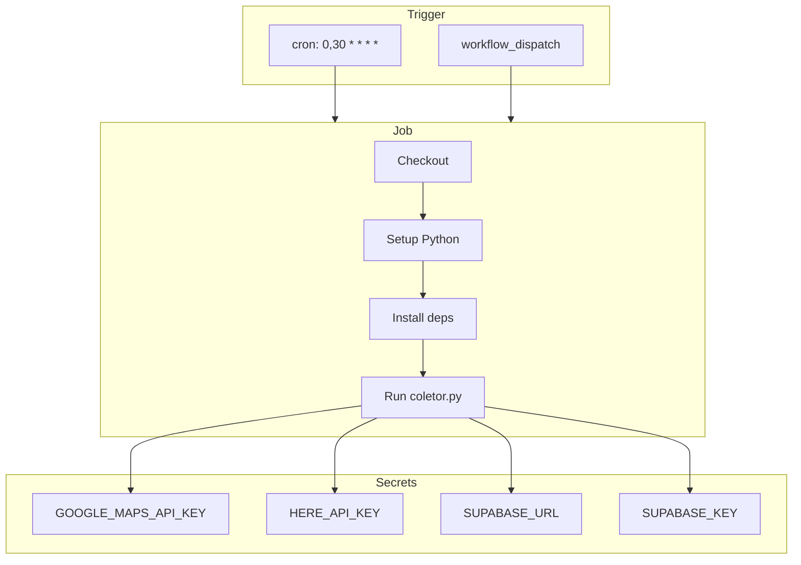

# Arquitetura de Deploy

## Infraestrutura em produção

## Rewrites do Vercel

| Source | Destination |
|--------|-------------|
| `/auth/:path*` | `https://monitoramento-dinamico-api.onrender.com/auth/:path*` |
| `/painel`, `/painel/:path*` | API Render |
| `/rotas/:path*` | API Render |
| `/(.*)` | `/index.html` (SPA fallback) |

## Pipeline de build

## GitHub Actions — Coletor

