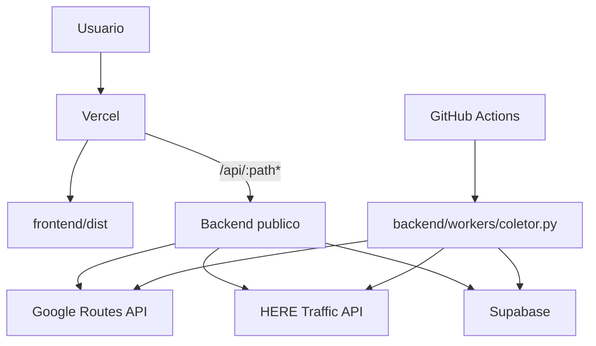
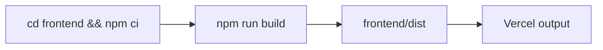
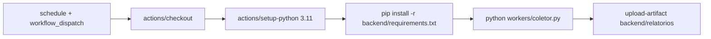

# Arquitetura de Deploy

## Topologia atual

## Rewrites do frontend

O contrato em producao esta centralizado em [`../../vercel.json`](../../vercel.json).

Regras relevantes:

| Source | Destino |
| --- | --- |
| `/api/:path*` | backend publico configurado no `vercel.json` |
| `/(.*)` | `/index.html` |

Observacao importante:

- o frontend sempre chama `"/api/*"`;
- a remocao do prefixo `/api` e responsabilidade da camada de rewrite/proxy.

## Build do frontend

## Workflow do worker

## Segredos operacionais

| Variavel | Uso |
| --- | --- |
| `GOOGLE_MAPS_API_KEY` | consulta Google Routes |
| `HERE_API_KEY` | consulta HERE |
| `SUPABASE_URL` | endpoint do banco |
| `SUPABASE_SERVICE_ROLE_KEY` | escrita de snapshots |
| `SUPABASE_KEY` | compatibilidade legada |
