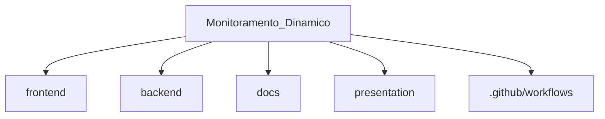
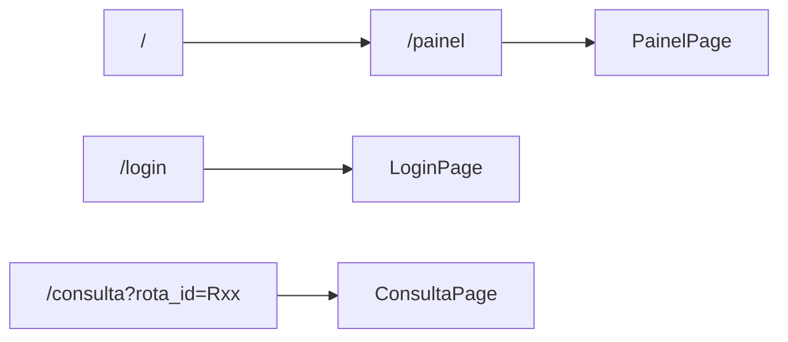
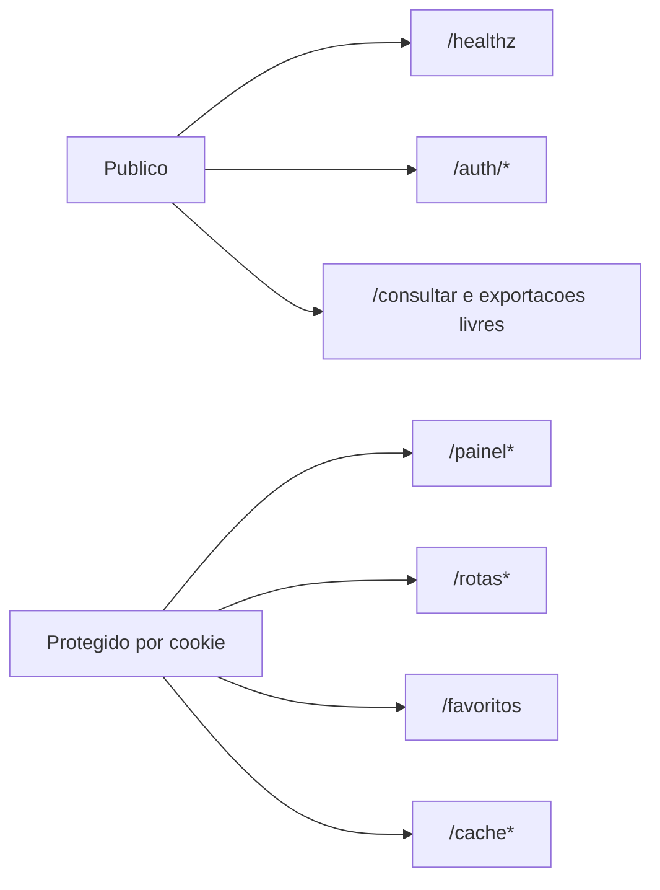

# Estrutura do Codebase

## Mapa rapido

## Frontend

| Caminho | Papel |
| --- | --- |
| `frontend/src/app/App.tsx` | roteamento principal |
| `frontend/src/app/pages/LoginPage.tsx` | login local |
| `frontend/src/app/pages/PainelPage.tsx` | grid operacional das rotas |
| `frontend/src/app/pages/ConsultaPage.tsx` | visao detalhada da rota |
| `frontend/src/app/services/api.ts` | cliente HTTP baseado em `/api` |
| `frontend/src/app/components/` | componentes visuais, mapa, cards e gauges |
| `frontend/vite.config.ts` | build, versionamento e proxy local |

## Backend

| Caminho | Papel |
| --- | --- |
| `backend/main.py` | entrada CLI e modo web |
| `backend/web/app.py` | aplicacao FastAPI e endpoints |
| `backend/core/consultor.py` | consulta e merge Google/HERE |
| `backend/core/painel_service.py` | resumo agregado do painel |
| `backend/core/auth_local.py` | autenticacao e sessao |
| `backend/core/config_loader.py` | configuracao com override por env var |
| `backend/storage/database.py` | cliente Supabase |
| `backend/storage/repository.py` | persistencia de snapshots |
| `backend/report/excel_simple.py` | exportacao Excel/CSV |
| `backend/workers/coletor.py` | worker agendado |
| `backend/tests/` | suite pytest |

## Dados e configuracao

| Caminho | Papel |
| --- | --- |
| `backend/data/rotas.json` | cadastro de 20 rotas corporativas |
| `backend/config.yaml` | defaults publicos da aplicacao |
| `backend/.env.example` | referencia de variaveis |
| `vercel.json` | build do frontend e rewrite de API |

## Rotas do frontend

## Grupos de rotas da API

