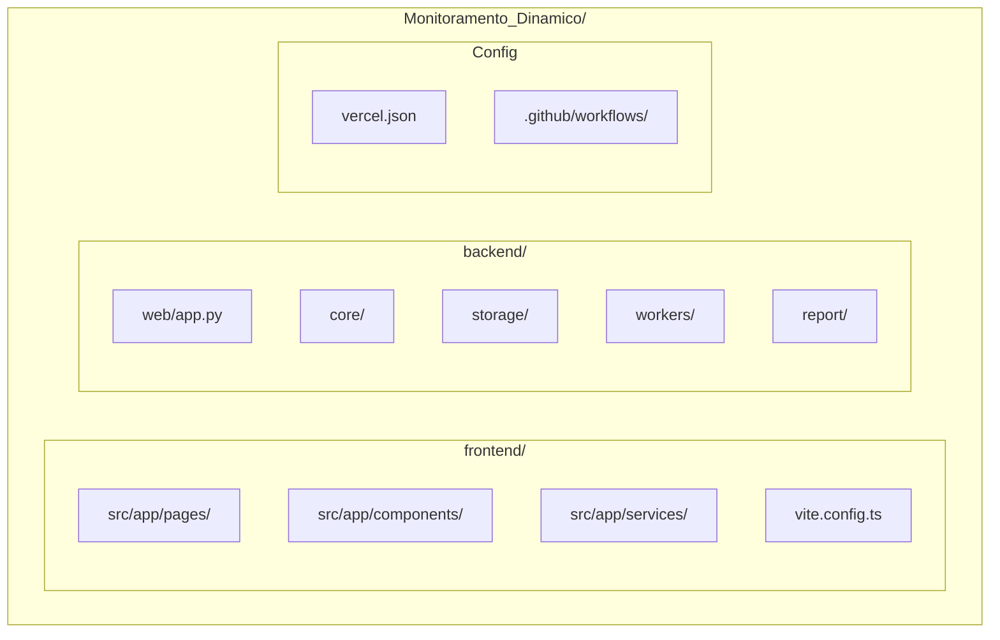
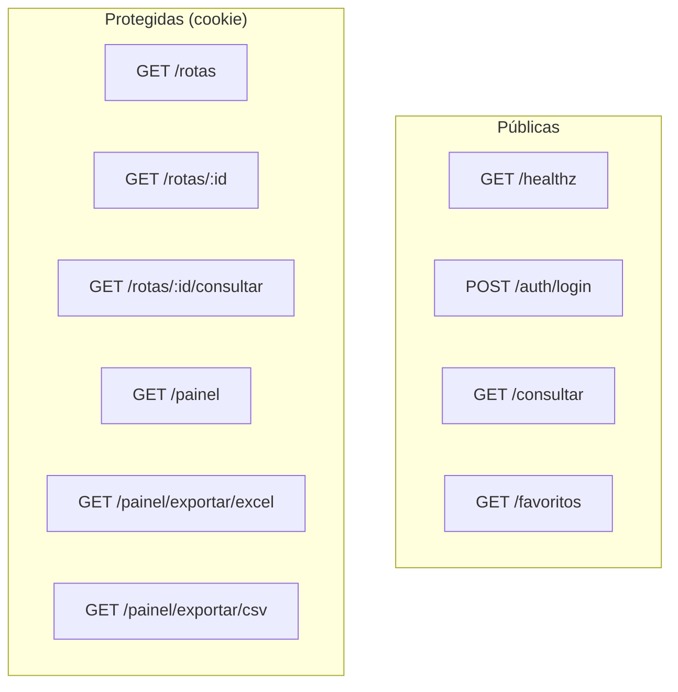
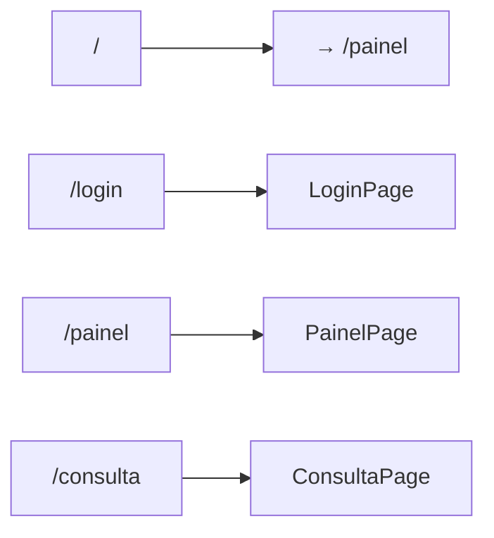

# Estrutura do Codebase

## Árvore de diretórios

## Detalhamento das pastas

### Frontend (`frontend/`)

| Pasta/Arquivo | Descrição |
|---------------|-----------|
| `src/app/pages/` | LoginPage, PainelPage, ConsultaPage |
| `src/app/components/` | MapView, RouteCard, GaugeChart, FilterDropdown, StatusTicker, RadarIcon, ui/* |
| `src/app/services/api.ts` | Cliente HTTP com `credentials: "include"` |
| `src/styles/` | index.css, tailwind.css, theme.css, fonts.css |

### Backend (`backend/`)

| Pasta/Arquivo | Descrição |
|---------------|-----------|
| `web/app.py` | Servidor FastAPI principal, rotas |
| `core/consultor.py` | Orquestrador de consultas (Google + HERE em paralelo) |
| `core/painel_service.py` | Agregação do painel (20 rotas) |
| `core/rotas_corporativas.py` | Carregamento de rotas.json |
| `core/auth_local.py` | Autenticação por cookie |
| `core/config_loader.py` | Carregamento de config.yaml |
| `core/cache.py` | Cache em memória (TTL 300s) |
| `core/google_traffic.py` | Integração Google Routes API |
| `core/here_incidents.py` | Integração HERE Traffic API |
| `storage/database.py` | Cliente Supabase (httpx) |
| `storage/repository.py` | Persistência de snapshots |
| `report/excel_simple.py` | Exportação Excel/CSV |
| `workers/coletor.py` | Job de polling (GitHub Actions) |

### Configurações

| Arquivo | Descrição |
|---------|-----------|
| `config.yaml` | API keys, cache, auth, Supabase |
| `rotas.json` | Rotas corporativas R01–R20 |
| `favoritos.json` | Favoritos + rotas predefinidas |

## Rotas da API (FastAPI)

## Rotas do Frontend (React Router)

