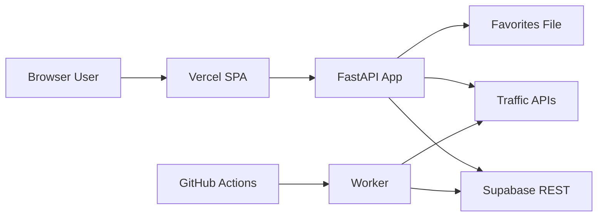

# Monitoramento_Dinamico Threat Model

## Executive summary
The top risks in this repository are concentrated in the internet-facing FastAPI application, specifically around cookie-based local authentication, unauthenticated state-changing endpoints, and public endpoints that can trigger paid upstream traffic lookups. The highest-risk paths are the local auth implementation in `backend/core/auth_local.py`, the public route surface in `backend/web/app.py`, and the scheduled worker path that writes with a Supabase service-role key.

## Scope and assumptions
- In scope:
  - `backend/web/app.py`
  - `backend/core/auth_local.py`
  - `backend/core/config_loader.py`
  - `backend/storage/database.py`
  - `backend/storage/repository.py`
  - `backend/workers/coletor.py`
  - `.github/workflows/monitor_dinamico.yml`
  - `frontend/src/`
  - `vercel.json`
- Out of scope:
  - `backend/tests/`
  - `backend/docs/`
  - ad hoc local scripts such as `backend/tmp_test_supa.py` and `backend/test_supa_key.py`
  - generated frontend build output in `frontend/dist/`
- Explicit assumptions used for this run:
  - The frontend is deployed as a Vercel-hosted SPA and rewrites browser requests to a separate public FastAPI backend, based on `vercel.json`.
  - The backend is intended to be reachable from the public internet and use cookie-based local auth for `/painel` and `/rotas`.
  - The worker runs on GitHub Actions every 30 minutes with production secrets injected from repository secrets.
  - Supabase is used as the persistence layer for aggregated historical snapshots only, while `favoritos.json` remains a local shared file on the backend host.
  - No extra edge protections (WAF, CDN rate limiting, security headers, host allowlists) should be assumed unless they are visible in repo code or config.
- Open questions that would materially change risk ranking:
  - Will `/consultar`, `/exportar/*`, `/favoritos`, and `/cache` remain intentionally public in production, or are they meant to be operator-only?
  - Is there any edge-level rate limiting, CSP, or response-header hardening configured outside this repository?
  - Is `auth_local` only a temporary bootstrap mechanism for a private operations team, or will it remain internet-exposed for some time?

## System model
### Primary components
- React/Vite SPA:
  - The browser client is mounted from `frontend/src/main.tsx:1-6` and uses same-origin fetches with cookies in `frontend/src/app/services/api.ts:1-22`.
- Vercel routing layer:
  - `vercel.json:1-28` builds the SPA and rewrites `/auth/*`, `/painel*`, and `/rotas/*` to a separate backend origin.
- FastAPI app:
  - The main internet-facing service is declared in `backend/web/app.py:49-53`, serves routing and export endpoints, and uses cookie-based local auth for protected endpoints.
- Local auth module:
  - Session creation and validation happen in `backend/core/auth_local.py:30-77`.
- Configuration loader:
  - Runtime config is loaded from YAML plus environment overrides in `backend/core/config_loader.py:41-103`.
- Local shared file store:
  - `backend/web/app.py:45-48` and `backend/web/app.py:137-148` use `favoritos.json` as a mutable shared file.
- Worker path:
  - `backend/workers/coletor.py:59-79` loads config, calls the consult pipeline, and persists results on a schedule.
- Supabase REST persistence:
  - `backend/storage/database.py:9-39` initializes an HTTP client with the Supabase service-role key.
  - `backend/storage/repository.py:12-62` writes `ciclos` and `snapshots_rotas`.
- GitHub Actions scheduler:
  - `.github/workflows/monitor_dinamico.yml:1-34` runs the worker on a cron schedule with backend secrets.

### Data flows and trust boundaries
- Internet user -> Browser SPA
  - Data types: route identifiers, dashboard data, login credentials, exported files.
  - Channel/protocol: HTTPS browser requests.
  - Security guarantees: browser sandbox only; no client-side secret storage was found.
  - Validation: route IDs are client-provided and passed to same-origin API calls.
- Browser SPA -> FastAPI backend (via same-origin Vercel rewrites)
  - Data types: cookies, login JSON, route IDs, free-form origin/destination inputs.
  - Channel/protocol: HTTPS to Vercel origin, then reverse-proxied to backend.
  - Security guarantees: cookie auth is used on selected endpoints; no CSRF token flow is visible; no rate limiting is visible in repo code.
  - Validation: basic parameter presence checks exist in `backend/web/app.py:151-157`, but auth coverage is partial.
- FastAPI backend -> External traffic APIs
  - Data types: route lookup parameters and API keys loaded from runtime config.
  - Channel/protocol: outbound HTTPS from server-side consult logic.
  - Security guarantees: secrets remain server-side if config is correct; no in-repo egress allowlist or per-request quota guard is visible.
  - Validation: backend normalizes some inputs before handing them to consult logic.
- FastAPI backend -> Local shared file (`favoritos.json`)
  - Data types: shared route definitions and user-added favorites.
  - Channel/protocol: local filesystem reads/writes.
  - Security guarantees: none beyond process file permissions; no auth boundary protects the write endpoints today.
  - Validation: payload is constrained to the `FavoritoIn` Pydantic model in `backend/web/app.py:76-79`.
- Worker -> Supabase REST
  - Data types: aggregated route status snapshots, timestamps, service-role bearer token.
  - Channel/protocol: outbound HTTPS via `httpx`.
  - Security guarantees: service-role key is loaded from environment/YAML and used as both `apikey` and `Authorization` header.
  - Validation: if credentials are missing, writes are skipped in `backend/storage/database.py:19-21`.
- GitHub Actions -> Worker runtime
  - Data types: Google API key, HERE API key, Supabase URL, Supabase service-role key.
  - Channel/protocol: GitHub-hosted CI job environment injection.
  - Security guarantees: relies on GitHub secrets and workflow integrity; no additional runtime isolation is visible in repo code.

#### Diagram

## Assets and security objectives
| Asset | Why it matters | Security objective (C/I/A) |
| --- | --- | --- |
| `AUTH_LOCAL_SESSION_SECRET` and effective session material | Controls who can impersonate authenticated operators | C, I |
| Local auth credentials | Gate access to `/painel` and `/rotas/*` | C, I |
| Google / HERE API keys | Abuse can consume paid quota or cause service throttling | C, A |
| Supabase service-role key | Grants high-privilege writes to persistence tables | C, I |
| `favoritos.json` | Drives shared route definitions and can alter user-visible routing behavior | I, A |
| Aggregated route snapshots in Supabase | Historical operational data used for dashboards and reporting | I, A |
| Vercel rewrite configuration | Defines which public routes reach the backend and under which origin model | I, A |
| GitHub Actions workflow integrity | Controls scheduled execution with privileged secrets | I, A |

## Attacker model
### Capabilities
- Remote unauthenticated attacker can send arbitrary HTTP requests to public backend routes if the service is internet-exposed.
- Remote attacker can automate repeated calls to cost-amplifying endpoints such as `/consultar` and export routes.
- Browser attacker can inspect their own cookies and all client-side code delivered to the browser.
- Authenticated low-privilege operator (or anyone who obtains default credentials) can access protected API responses and reuse observed session material.
- External party can interact with Vercel-served frontend routes exactly as a normal browser user, including hard refreshes and direct navigation.

### Non-capabilities
- A remote attacker is not assumed to have direct shell access to the backend host, GitHub Actions runner, or Supabase infrastructure.
- A remote attacker is not assumed to read environment variables directly unless the application leaks them.
- A remote attacker is not assumed to modify repository code, GitHub secrets, or Vercel settings without a separate compromise.
- There is no evidence in repo code of multi-tenant isolation or tenant-scoped auth; this is treated as a single-tenant operations application.

## Entry points and attack surfaces
| Surface | How reached | Trust boundary | Notes | Evidence (repo path / symbol) |
| --- | --- | --- | --- | --- |
| `/auth/login` | Browser POST with JSON body | Browser -> FastAPI | Issues cookie-based session state | `backend/web/app.py:282-296` |
| `/auth/session` | Browser GET with cookies | Browser -> FastAPI | Returns auth state to frontend bootstrap | `backend/web/app.py:307-317` |
| `/rotas`, `/rotas/{id}`, `/rotas/{id}/consultar`, `/painel` | Browser GET with cookies | Browser -> FastAPI | Protected by `Depends(verificar_autenticacao)` | `backend/web/app.py:322-380` |
| `/consultar`, `/exportar/*`, `/consultar/exportar/*` | Browser GET with query params | Browser -> FastAPI | Public endpoints that can trigger upstream traffic lookups | `backend/web/app.py:257-277`, `backend/web/app.py:383-436`, `backend/web/app.py:617-634` |
| `/favoritos` (GET/POST/DELETE) | Browser requests | Browser -> FastAPI -> local file | Shared mutable state with no auth guard today | `backend/web/app.py:439-483` |
| `/cache` and `/cache/info` | Browser requests | Browser -> FastAPI -> in-memory cache | Cache mutation and cache metadata are public today | `backend/web/app.py:486-503` |
| Vercel rewrites | Browser navigation on same origin | Browser -> Vercel -> FastAPI | Defines backend exposure shape for SPA routes | `vercel.json:6-27` |
| Worker scheduled execution | GitHub cron / manual dispatch | GitHub Actions -> worker -> external services | Runs with high-privilege secrets on a timer | `.github/workflows/monitor_dinamico.yml:3-34`, `backend/workers/coletor.py:59-79` |
| Supabase REST writes | Worker and possibly backend process | App/worker -> Supabase | Uses service-role bearer token | `backend/storage/database.py:23-34`, `backend/storage/repository.py:24-55` |

## Top abuse paths
1. Session forgery through cookie disclosure:
   attacker logs in once (or steals one cookie), reads the cookie value, extracts the server secret embedded in the cookie payload, forges `username|secret` for another username, and replays it to access protected endpoints.
2. Default credential takeover:
   the service is deployed with `auth_local.enabled: true` and placeholder credentials intact, the attacker authenticates with known defaults, receives a valid cookie, and gains access to operator-only route data.
3. Shared state tampering:
   an unauthenticated caller sends `POST /favoritos` or `DELETE /favoritos`, mutates the shared `favoritos.json` file, and changes what later operators or jobs read from the backend.
4. Availability and cost exhaustion:
   an attacker scripts repeated calls to `/consultar` and export endpoints, forcing server-side calls to paid upstream traffic APIs, exhausting quota and degrading response time for legitimate users.
5. Cache disruption:
   an unauthenticated caller repeatedly hits `DELETE /cache`, forcing cache misses and amplifying expensive recomputation.
6. Privileged data write abuse after app compromise:
   once the backend or worker execution context is compromised, the attacker can reuse the Supabase service-role token to write or poison historical records in `ciclos` and `snapshots_rotas`.

## Threat model table
| Threat ID | Threat source | Prerequisites | Threat action | Impact | Impacted assets | Existing controls (evidence) | Gaps | Recommended mitigations | Detection ideas | Likelihood | Impact severity | Priority |
| --- | --- | --- | --- | --- | --- | --- | --- | --- | --- | --- | --- | --- |
| TM-001 | Remote user with one valid cookie or login path | Attacker can obtain a valid cookie once, or use any valid login path, then inspect client-side cookie contents | Extract the embedded session secret from the cookie and forge arbitrary `username|secret` values | Auth bypass and impersonation of any local operator identity | Session secret, auth credentials, protected route data | Cookie is `HttpOnly` and `SameSite=Lax` in `backend/core/auth_local.py:38-44`, but content still reaches the browser | The secret is sent to the client in cleartext and validation only compares the echoed secret | Replace with an opaque random session ID or signed server-generated token; never put secrets in cookies; fail closed if placeholder secrets remain | Log impossible username switches, repeated cookie validation failures, and auth events per IP | High | High | critical |
| TM-002 | Remote unauthenticated user | Deployment keeps `auth_local.enabled` true without environment overrides | Authenticate with known placeholder credentials and gain a legitimate session | Unauthorized access to operator-only dashboard and route detail APIs | Local auth credentials, protected route data | Config loader supports env overrides in `backend/core/config_loader.py:83-93` | Startup does not fail if placeholder values remain; versioned config keeps known defaults | Refuse startup when placeholder username/password/secret are present in non-dev mode; default `auth_local.enabled` to false; require env-backed secrets in production | Alert on successful logins using placeholder usernames, and on any production start with placeholder values detected | Medium | High | high |
| TM-003 | Remote unauthenticated user | Backend is public and no upstream auth filter blocks these routes | Call `/favoritos` or `/cache` state-changing endpoints without logging in | Integrity loss in shared route definitions and availability degradation through cache churn | `favoritos.json`, cache state, downstream operator trust | `FavoritoIn` constrains JSON shape in `backend/web/app.py:76-79`; cache APIs exist | No `Depends(verificar_autenticacao)` on `POST /favoritos`, `DELETE /favoritos`, or `DELETE /cache` | Protect all state-changing shared-state endpoints with authentication and, if operator browser calls remain, add CSRF protection for cookie auth; consider moving favorites to user-scoped storage | Log all state-changing calls with actor identity, alert on anonymous mutations, track cache clear frequency | High | Medium | high |
| TM-004 | Remote unauthenticated user or bot | Internet exposure to public consult/export routes | Repeatedly invoke `/consultar` and export routes to force expensive server-side upstream lookups | Upstream quota exhaustion, latency spikes, possible service throttling or extra cost | Google/HERE API keys, application availability | Basic input presence validation in `backend/web/app.py:151-157`; some cache exists for aggregate views only | No visible auth gate, quota guard, or rate limiting for free-form lookup and export endpoints | Add edge and app-layer rate limiting, require auth for expensive endpoints, cache identical requests safely, add circuit breakers and observability on upstream error rates | Track requests per IP, upstream call counts, export volume, and sudden spikes in 4xx/5xx from providers | High | Medium | high |
| TM-005 | Internet user performing reconnaissance | Backend is exposed publicly with default FastAPI docs and no visible edge hardening in repo | Enumerate `/docs` and `/openapi.json`, then use discovered routes and weak defaults to target higher-value surfaces | Easier discovery of sensitive routes and weaker browser hardening posture | Route inventory, operator workflow, frontend trust model | The app does return generic 500 payloads in `backend/web/app.py:168-243` and frontend uses same-origin fetches | FastAPI docs are not disabled in `backend/web/app.py:49-53`, and `vercel.json:1-28` has rewrites but no security headers block | Disable or gate docs in production, add security headers at the edge (`CSP`, `frame-ancestors` or `X-Frame-Options`, `nosniff`, `Referrer-Policy`), and consider `TrustedHostMiddleware` | Monitor access to `/docs`, `/redoc`, and `/openapi.json`; capture header baselines in synthetic checks | Medium | Low | medium |
| TM-006 | Attacker with code execution in backend or worker context | Separate compromise of app host, dependency chain, or CI job integrity | Reuse the Supabase service-role token to write or poison operational history | Historical data tampering and loss of trust in aggregated monitoring data | Supabase service-role key, historical snapshots | Writes are centralized in `backend/storage/repository.py:12-62`; missing creds short-circuit in `backend/storage/database.py:19-21` | A single long-lived service-role key has broad write power for the persistence path | Scope Supabase access as narrowly as possible, rotate secrets, isolate worker-only credentials from read path where feasible, and add write-audit monitoring in Supabase | Audit write patterns by source, alert on unusual write bursts or schema anomalies, and review GitHub Actions provenance | Low | High | medium |

## Criticality calibration
- Critical:
  - Any issue that directly enables impersonation of an operator or bypass of the only auth boundary.
  - Example: forging `projeto_zero_session` without knowing a server-only secret.
  - Example: a pre-auth path to write arbitrary data into Supabase using the service-role key.
- High:
  - Issues that expose operator-only route data, let an unauthenticated user change shared runtime state, or reliably consume critical paid upstream resources.
  - Example: placeholder credentials left enabled in production.
  - Example: anonymous writes to `favoritos.json`.
  - Example: repeated public `/consultar` calls that exhaust provider quota.
- Medium:
  - Issues that amplify attack efficiency or materially weaken integrity/availability but still need another weakness or stronger preconditions.
  - Example: public docs and missing in-repo hardening headers.
  - Example: worker compromise leading to abuse of the Supabase service-role key.
  - Example: repeated anonymous cache clears.
- Low:
  - Recon, minor information disclosure, or issues that are mostly dependent on absent-but-possible infrastructure controls.
  - Example: documentation exposure when the backend is otherwise strongly gated upstream.
  - Example: browser hardening gaps that are already enforced outside this repository.

## Focus paths for security review
| Path | Why it matters | Related Threat IDs |
| --- | --- | --- |
| `backend/core/auth_local.py` | Contains the local session format, cookie issuance, and validation logic that define the current auth boundary | TM-001, TM-002 |
| `backend/web/app.py` | Exposes the internet-facing route surface, auth coverage, and state-changing endpoints | TM-002, TM-003, TM-004, TM-005 |
| `backend/core/config_loader.py` | Controls whether runtime secrets override placeholder values or leave insecure defaults active | TM-002, TM-006 |
| `backend/config.yaml` | Stores the shipped fallback auth posture and placeholder credentials | TM-002 |
| `backend/storage/database.py` | Initializes the high-privilege Supabase HTTP client and bearer token usage | TM-006 |
| `backend/storage/repository.py` | Defines what privileged writes the worker performs in Supabase | TM-006 |
| `backend/workers/coletor.py` | Schedules privileged data collection and persistence with production secrets | TM-004, TM-006 |
| `.github/workflows/monitor_dinamico.yml` | Defines how secrets reach the scheduled worker and what executes on cron | TM-006 |
| `frontend/src/app/services/api.ts` | Shows the browser trust model, cookie usage, and same-origin fetch behavior | TM-001, TM-005 |
| `vercel.json` | Defines the public routing shape and current lack of in-repo edge header hardening | TM-005 |

## Quality check
- Covered the discovered entry points: login/session, protected route reads, public consult/export, favorites/cache, worker cron path, and Supabase writes.
- Mapped each trust boundary at least once into the threat table.
- Kept runtime paths separate from CI and separate from tests/docs/local helper scripts.
- No additional user clarification was available during this run, so the report proceeds on explicit assumptions documented above.
- Assumptions and open questions are listed in the scope section and materially affect the ranking of TM-003 through TM-005.
